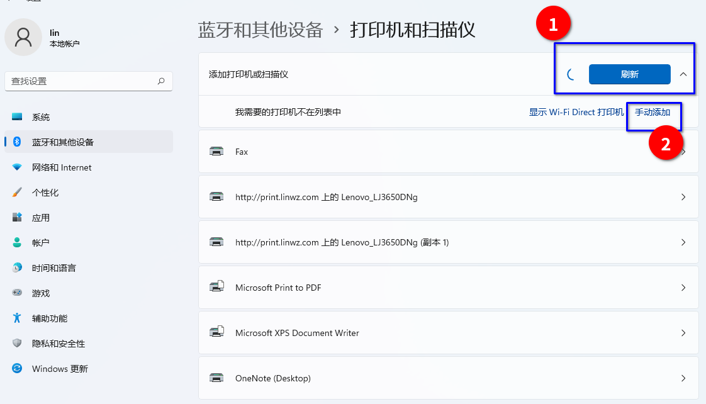
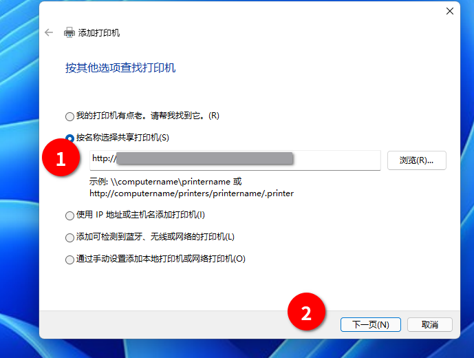
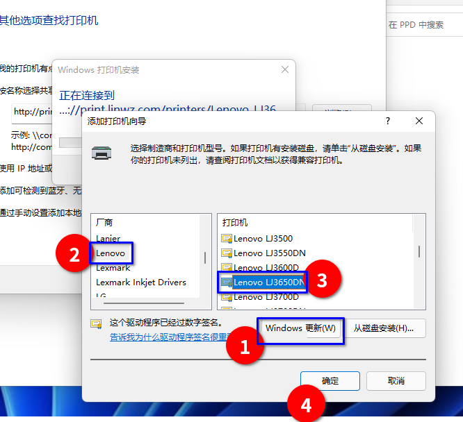

背景知识：打印机目前位于洁琼楼220，打印前提前跟老师说明。

## 使用前必读

- 打印机出问题就不要使用，**不要**试图维修、切断电源、重启、拔插任何线等任何操作。

- 本文为使用window 11电脑进行打印机无线连接步骤，只允许无线连接使用，**不允许**拔下usb连接线连到自己的电脑上等其他操作。

- 使用linux电脑的可以用cups添加，操作类似，驱动选择generic pcl driver即可，或找老师索要ppd文件。

- Mac电脑请自行摸索。

### 1.打开设置 
- 点击添加按钮，等一会。
- 出现手动添加选项后，点击。

### 2.输入打印机网址
- 网址请向老师索要。
- 点击下一页。

### 3.添加驱动
- 先点击Windows 更新按钮，这步视网速需要等几分钟，不要着急。
- 更新完成后在左边厂商找到lenovo
- 右边型号选择LJ3650DN
- 点击确定，这里也会需要等一下，不要着急。
- 以上等待时间如果过长（超过十几分钟），可以视情况关掉窗口重新再来。

### 4. 完成以上步骤（没提到的就是点下一页），即可直接选择刚刚添加的打印机打印。
